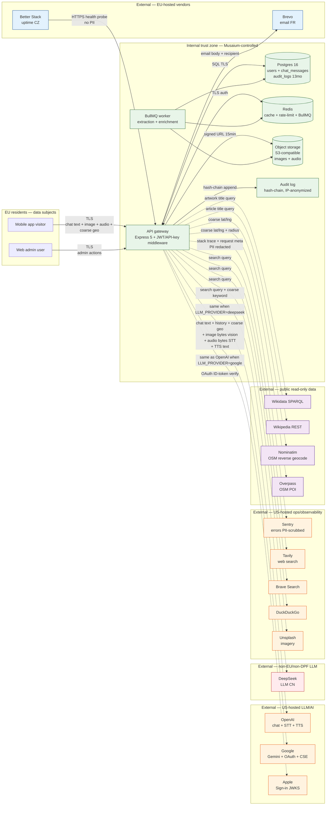

# Data Flow Map — GDPR Art 30 + 44-49 Evidence

**Last review**: 2026-04-26
**Companion to**: `SUBPROCESSORS.md` (vendor inventory) and `team-reports/2026-04-26-security-compliance-full-audit.md` (gap analysis)

This diagram and tables map every cross-trust-boundary data movement in Musaium, anchoring each flow to (a) an env var, (b) a code path, and (c) a GDPR lawful basis. Trust boundaries follow the STRIDE model in audit § 3.

---

## 1. Diagram



> Solid arrows = always-on flows; dotted = consent- or feature-gated. Subgraph color encodes transfer-risk tier (green = internal, blue = EU, orange = US/DPF, red = non-DPF, purple = public read-only).

---

## 2. Per-flow GDPR classification

| # | Flow | Data class | Art 6 basis | Cross-border? | Risk tier |
|---|------|------------|-------------|---------------|-----------|
| F1 | Visitor → API: chat text + history | Chat content (sanitized), session metadata | 6(1)(a) consent | No (visitor → EU/US infra TLS only) | LOW |
| F2 | Visitor → API: uploaded image | Image bytes (may contain EXIF — audit V6 = NOT stripped) | 6(1)(a) consent | No | MEDIUM (EXIF leak surface) |
| F3 | Visitor → API: voice audio | Raw audio ≤12 MB (voice biometric per Art 9 risk surface) | 6(1)(a) consent | No | MEDIUM |
| F4 | Visitor → API: geolocation | Latitude/longitude (coarse-rounded server-side) | 6(1)(a) explicit consent (`location_to_llm`) | No | LOW |
| F5 | API → Postgres (DB) | All persisted data (chat_messages, users, audit_logs, museum entities) | 6(1)(b) contract | No (single-region) | LOW |
| F6 | API → Redis | Session cache, rate-limit counters, **LLM cache (audit V4: missing userId scoping → cross-user leak risk)** | 6(1)(f) legitimate interest | No | **HIGH** (audit I1) |
| F7 | API → S3 | Image + audio binaries (audit V5: orphan after DB purge → erasure failure) | 6(1)(b) contract | If non-EU bucket: yes — TBD | MEDIUM-HIGH |
| F8 | API → audit log | IP, UA, admin actions; IP anonymized after 13mo, hash-chain integrity | 6(1)(c) legal obligation + 6(1)(f) | No | LOW |
| F9 | API → OpenAI (chat + history + coarse geo + image vision + audio STT + TTS text) | All chat content + image + audio | 6(1)(a) consent | **YES — US (default), EU zone available** | HIGH (volume + sensitivity) |
| F10 | API → Google (Gemini, when `LLM_PROVIDER=google`) | Same as F9 | 6(1)(a) consent | **YES — US** | HIGH (DPF in force, but post-Schrems II monitoring required) |
| F11 | API → DeepSeek (when `LLM_PROVIDER=deepseek`) | Same as F9 | 6(1)(a) consent | **YES — China, NO adequacy** | **CRITICAL** (do not enable for EU subjects without SCC + TIA + supplementary safeguards) |
| F12 | API → Apple JWKS | Read-only public-key fetch — no PII outbound | 6(1)(b) contract | YES — US (read-only) | LOW |
| F13 | API ↔ Google OAuth (token verify) | Google ID-token signature verification | 6(1)(b) contract | YES — US (DPF) | LOW |
| F14 | API → Brevo (transactional email) | Recipient email + body (verification link, ticket, magic link) | 6(1)(b) contract + 6(1)(c) | NO — EU (FR) | LOW |
| F15 | API → Sentry (errors) | Stack traces + request meta; PII scrubber (audit § 4 V11/I2) | 6(1)(f) legitimate interest | **YES if US DSN — TBD; NO if EU DSN** | MEDIUM |
| F16 | API → Tavily / Brave / DDG / Unsplash (search & imagery) | Search query string only (sanitized) | 6(1)(a) or 6(1)(f) | YES — US | MEDIUM (Tavily DPA missing — audit P0) |
| F17 | API → Wikidata / Wikipedia | Read-only enrichment query strings (no PII) | 6(1)(f) legitimate interest | YES — US (Wikimedia) | LOW (public dataset, no PII) |
| F18 | API → Nominatim / Overpass | Coarse geo coords + radius | 6(1)(a) consent | YES — UK + DE | LOW (coarse-only, public service) |
| F19 | Better Stack → API health probe | Outbound from BS to Musaium; payload = redacted health JSON | 6(1)(f) | Probe origin global; vendor EU (CZ) | LOW |
| F20 | API → OTLP collector (when `OTEL_ENABLED=true`) | Span attributes — no PII by design | 6(1)(f) | Operator-controlled | LOW (vendor TBD per § 2.10 of `SUBPROCESSORS.md`) |

---

## 3. Trust boundary controls (mapped to audit § 3)

| Boundary | Direction | Controls | Audit reference |
|----------|-----------|----------|-----------------|
| Visitor → API | inbound | TLS, JWT/API-key, rate limit (IP/session/user/daily), CORS allow-list | STRIDE S1, D2 |
| API → DB | internal | TLS, parametrized queries, hash-chain on audit | T3 |
| API → Redis | internal | password/auth, key TTLs (7d/30d) | I1 (cache leak — open) |
| API → S3 | internal-out | SigV4 signed URLs (15min TTL), MEDIA_SIGNING_SECRET distinct from JWT (SEC-HARDENING L3) | S3, E3 |
| API → LLM (OpenAI/Google/DeepSeek) | external (third-country) | Per-call budget 25s, circuit breaker, output guardrail, structural prompt isolation, sanitization, **NO DPA/SCC documented yet — audit V7 P0** | D3, I3, V7 |
| API → enrichment (Wikidata/OSM/Unsplash) | external (mixed) | Per-client timeouts, SSRF private-IP allow-list block, fail-open on degradation | D7, V1 SSRF |
| API → Sentry | external-out | PII redactor (authz/cookie/email/token/secret), email → SHA-256 fingerprint | I2 |
| API → Brevo | external-out (EU) | API key, no PII beyond recipient + transactional payload | — |
| Better Stack → API | external-in | Public `/api/health` only; prod redacts version/commit (SEC-HARDENING L4) | I6 |

---

## 4. Open issues blocking GDPR sign-off (cross-ref audit § 2)

| Audit ID | Title | Owner | Linked flow(s) |
|----------|-------|-------|----------------|
| G1 / V7 | No DPA / SCC documented for OpenAI / Google / DeepSeek / Brevo / Sentry / Unsplash | Legal + Tech lead | F9, F10, F11, F14, F15, F16 |
| G2 | No DSAR endpoint (Art 15, 20) | BE team | F1, F2, F3, F4, F5, F7 |
| G3 / V12 | No breach SLA / playbook (Art 33/34) | Tech lead + Legal | All |
| G4 / V5 | S3 audio + image orphans after DB purge | BE team | F7 |
| G5 / V4 | LLM cache key omits userId — cross-user leak | BE team | F6, F9-F11 |
| G6 | No DPIA (Art 35) — geo + AI + voice biometric | DPO (TBD) | F3, F4, F9-F11 |
| G7 | Consent ungranular (only `location_to_llm`) | Product + BE | F2, F3, F9-F11 |
| G9 / V6 | EXIF not stripped on uploaded images | BE team | F2 |
| G10 | No ROPA (Art 30) committed | Legal | All |
| G11 | Privacy policy not audited for sub-processor list completeness | Legal | All — drives publication of `SUBPROCESSORS.md` |
| G12 | No transfer impact assessment for US-based LLM | Legal | F9, F10, F15, F16 |

---

## 5. Maintenance contract

When any of the following change, both `SUBPROCESSORS.md` and this diagram MUST be updated in the same PR:

- New env var of shape `*_API_KEY`, `*_DSN`, `*_ENDPOINT`, `*_URL` in `museum-backend/src/config/env.ts`
- New outbound HTTP client under `museum-backend/src/shared/http/` or `**/adapters/secondary/`
- New scheduled cron / BullMQ job that emits to a 3rd-party
- New webhook ingress (e.g. payment, identity provider)

Verification command (run pre-merge):

```bash
grep -nE 'apiKey|ApiKey|API_KEY|dsn|endpoint' museum-backend/src/config/env.ts
```

Every line of output must map to a row in `SUBPROCESSORS.md`.
